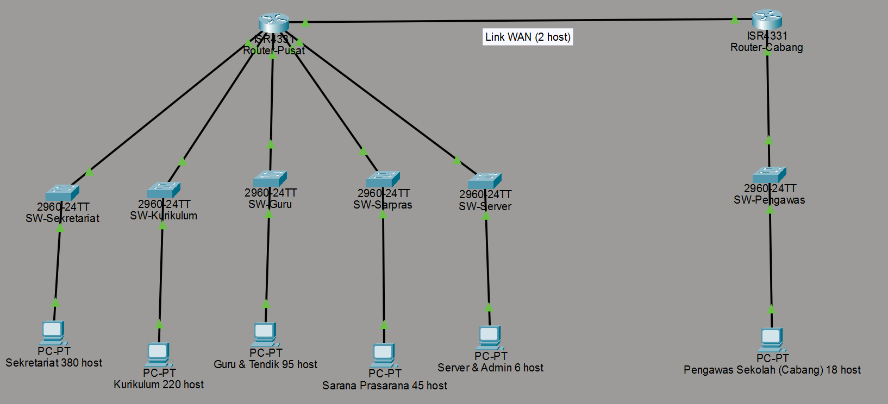
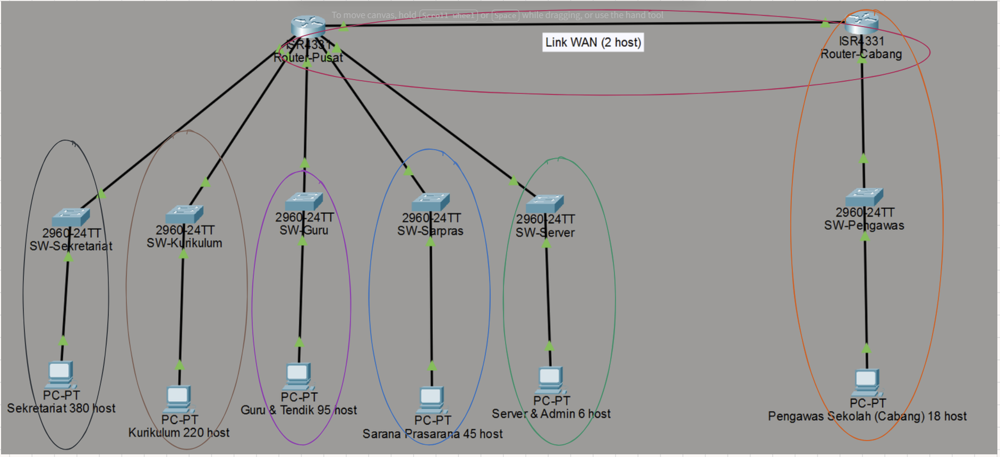

# Tugas-Jarkom-Subnetting-Routing

# Dokumentasi Pengerjaan Tugas Subnetting & Routing

Dokumentasi ini merangkum proses pengerjaan tugas subnetting untuk mata kuliah Komunikasi Data dan Jaringan Komputer, berdasarkan studi kasus yang diberikan.

* **NRP:** `5027241079`
* **Studi Kasus:** Alokasi IP untuk Kantor Pusat (5 LAN) dan Kantor Cabang (1 LAN).

## 1. Penentuan Base Network

*Base network* ditentukan berdasarkan NRP dengan rumus `10.(NRP mod 256).0.0`.

* `5027241079 mod 256 = 119`
* **Base Network:** `10.119.0.0`

## 2. Desain Topologi Jaringan

Topologi dirancang menggunakan Cisco Packet Tracer (CPT) untuk memvisualisasikan 6 LAN (5 di Kantor Pusat, 1 di Kantor Cabang) dan 1 link WAN yang menghubungkan kedua router.

## 3. Perhitungan Subnetting (VLSM)

Dilakukan perhitungan alokasi IP menggunakan metode **VLSM (Variable Length Subnet Mask)**. Kebutuhan host diurutkan dari yang terbesar ke terkecil untuk efisiensi alokasi.

**Kebutuhan Host:**

1.  **Sekretariat:** 380 host
2.  **Bidang Kurikulum:** 220 host
3.  **Bidang Guru & Tendik:** 95 host
4.  **Bidang Sarana Prasarana:** 45 host
5.  **Bidang Pengawas Sekolah (Cabang):** 18 host
6.  **Server & Admin:** 6 host
7.  **Link WAN (Router-ke-Router):** 2 host

Hasil perhitungan VLSM adalah sebagai berikut:

## 4. Tabel Hasil CIDR

Tabel hasil pembagian CIDR pada dasarnya adalah hasil dari penerapan metode VLSM, karena VLSM adalah teknik untuk mengimplementasikan **CIDR (Classless Inter-Domain Routing)**. Oleh karena itu, isi tabel ini identik dengan tabel VLSM.

Label `A1` hingga `A7` digunakan untuk mempermudah referensi pada tabel penggabungan.

## 5. Visualisasi Pembagian CIDR (Pohon CIDR)

Proses pembagian VLSM/CIDR dapat divisualisasikan sebagai "pohon" (akar beranak). Dimulai dari satu blok besar (`/22`), yang kemudian dibagi (dipecah) menjadi cabang-cabang yang lebih kecil (`/23`, `/24`, `/25`, dst.) hingga alokasi "daun" terkecil (`/30`).

Visualisasi lain dari pembagian blok IP:

## 6. Perhitungan Supernetting (Penggabungan CIDR)

**Supernetting** adalah proses kebalikan dari subnetting, yaitu menggabungkan kembali beberapa subnet kecil yang berdekatan (kontigu) menjadi satu blok IP yang lebih besar (Supernet).

Proses ini dilakukan secara *bottom-up*, dimulai dari subnet "daun" (prefix terbesar, cth: `/30`, `/29`) dan digabungkan secara bertahap ke atas.

Tabel pembantu berikut digunakan untuk memetakan proses penggabungan:

Hasil akhir dari tabel penggabungan menunjukkan bahwa semua 7 subnet (A1-A7) dapat diringkas menjadi satu supernet.

**Hasil Supernet Akhir:** `10.119.0.0/22`